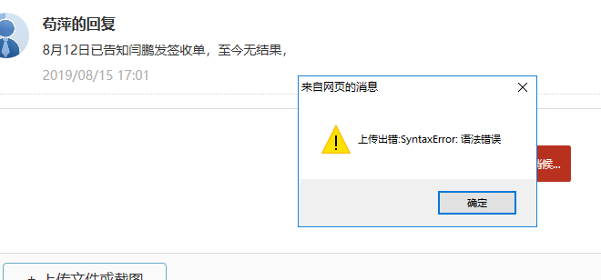
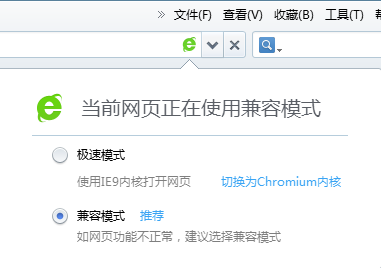
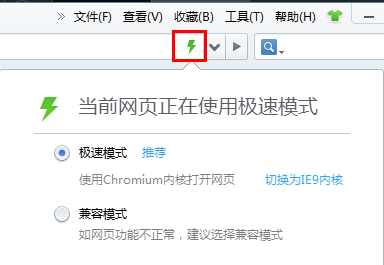

# 新增或回复CRM时无法上传图片？

由于浏览器及程序开发的问题，部分用户在使用360安全浏览器、360极速浏览器、QQ浏览器、搜狗浏览器等“双核浏览器”时，会进入兼容模式，导致无法进入CRM或者在新增和回复CRM时，无法上传图片。

### 解决方法：切换成极速模式后刷新页面

针对上述问题，用户可以在当前浏览器的地址栏末尾（或开头）找到切换模式的按钮，鼠标左键点击后，即可出现切换模式的选项：

选择极速模式：

选择成极速模式后，刷新下浏览器，重新进入该页面即可正常使用。

### 附录：各大浏览器如何切换模式

[360浏览器](http://se.360.cn/v6/help/help5.html)

[搜狗浏览器](https://zhinan.sogou.com/guide/detail/?id=316512375298)

