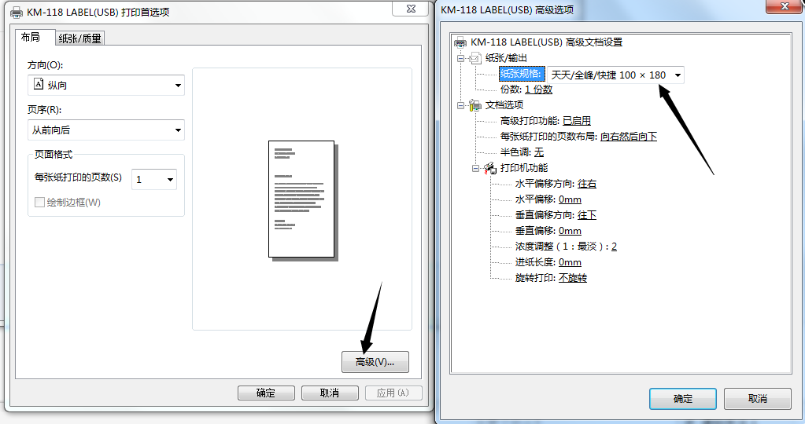

# 打印标签或纸张会打一张空一张（跳单）

在使用标签打印机或者A4纸张打印机的时候，经常会出现“每打印一张纸或者标签，隔着出一张空白的纸或标签”的情况。这种情况一般是打印机的纸张大小设置不正确，打印机没有正确测得纸张大小导致的。可以按照下面的方法解决。

## 第一步：设置打印机

先进入打印机首选项里面，把打印机里面的纸张尺寸修改为面单纸、标签的尺寸 ，**请根据实际情况设置**：



## 第二步：打印机重新测纸

第一步打印机设置成功之后，需要对打印机进行重新测纸，步骤如下：

 初始化打印机（热敏机通用方法通用，比如TSC、斑马、科诚、新北洋等全品牌通用）

```text
  打印机关机
  按住机器上方出纸键不放手，开机等待五到十秒后再放开按键
  机器会自动走纸到撕纸位置
  测纸完成
  如未到撕纸位置，请重复上面操作，一定要到撕纸位才代表机器已侦测到纸张大小
```

注意： 如果严格安装以上步骤还是无法解决，请联系打印机售后调试、修理打印机。

附打印机售后方式：

> **得实** [http://dascom.cn/](http://dascom.cn/)
>
> **科诚** [http://www.godexintl.com/cn/html/Customer\_care](http://www.godexintl.com/cn/html/Customer_care)
>
> **TSC** [http://www.tscprinters.com.cn/html/technology/technology.htm](http://www.tscprinters.com.cn/html/technology/technology.htm)
>
> **爱普生** [http://www.epson.com.cn/Apps/tech\_support/index.aspx](http://www.epson.com.cn/Apps/tech_support/index.aspx)
>
> **斑马** [http://www.zebra888.cn/](http://www.zebra888.cn/)
>
> **汉印**  [http://cn.hprt.com/LianXiWoMen/](http://cn.hprt.com/LianXiWoMen/)
>
> **惠普** [http://support.hp.com/cn-zh](http://support.hp.com/cn-zh)
>
> **佳博** [http://www.gainscha.com/contactus.asp?id=12](http://www.gainscha.com/contactus.asp?id=12)
>
> **快麦** [http://www.kuaimai.la/index.php/home/contact/index](http://www.kuaimai.la/index.php/home/contact/index)
>
> **启锐** [http://www.qrprt.com/contract.html](http://www.qrprt.com/contract.html)
>
> **维融** [http://www.weirong.cn/online.asp](http://www.weirong.cn/online.asp)
>
> **芯烨** [http://www.xprinter.net/contact?c=22](http://www.xprinter.net/contact?c=22)
>
> **新北洋** [http://www.snbc.cn/messages\_list/FrontColumns\_navigation01-zxdyFirstColumnId=64.html](http://www.snbc.cn/messages_list/FrontColumns_navigation01-zxdyFirstColumnId=64.html)

