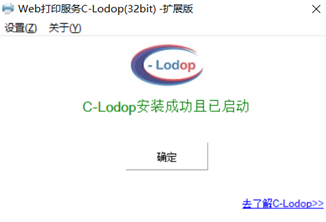

# 打印遇到问题

如果您的打印机可以正常打印电脑里的文件（如果不正常，请设置打印机），但是点击系统中的打印按钮后，并未打印，请参考以下说明操作即可：

1.[点击此处下载打印控件](https://www.fron.net/print/install_lodop32.exe)

2.双击打开上述安装文件，后面不用做任何更改，全部默认选项，选择“是”或者“确定”，然后点击“NEXT”

3.出现启动界面后等待软件启动

4.打开谷歌浏览器（其他浏览器可能不行），点击“刷新”按钮，再点击打印即可

